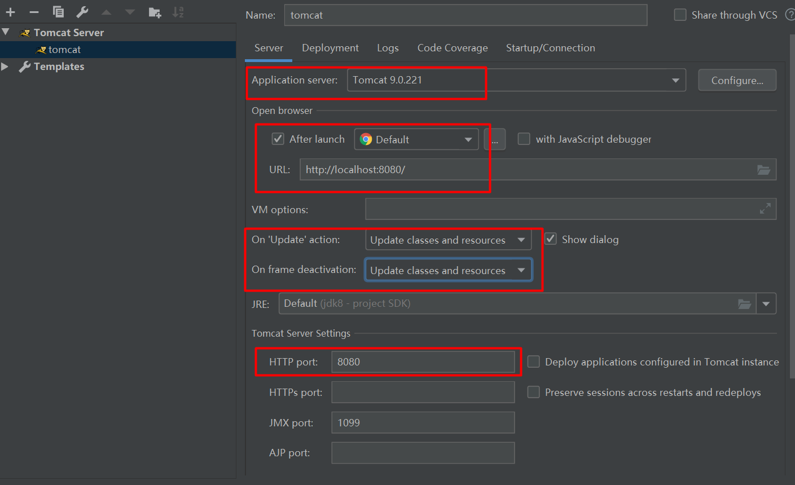
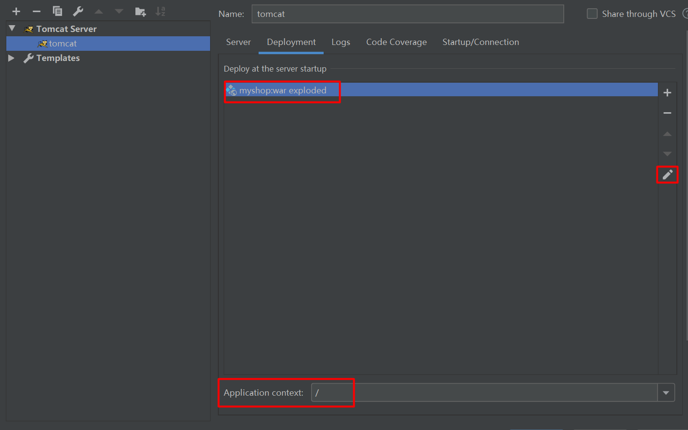

# Intellij IDEA

​	　IDEA 全称 IntelliJ IDEA，是互联网公司主流的 Java 集成开发环境，在智能代码助手、代码自动提示、重构、J2EE 支持、各类版本同步工具(`git`、`svn`、`github`等)、JUnit、CVS 整合、代码分析、 创新的 GUI 设计等方面的功能拥有着卓越的效率。

## IDEA Setting

​	　IDEA中的环境配置有`Setting`和`Default Setting`，两种配置项相同，只是作用范围不同。`Setting`用于特定的项目中，`Default Setting`是共用的配置。

### 快捷键简介

```
[代码编辑]
- ctrl + w：智能选取，实现选取范围的不断扩充
- crtl + alt + l：代码格式化
- shift + alt + insert：列编辑
- 双击选中 -> shift + F6 ：批量修改

[自动生成代码]
- alt + insert：自动代码生成
- psvm + enter: 快捷生成main代码
- sout + enter: 快捷生成System.out.println();
- .val : 快捷生成变量名
- div.container + tab : 自动生成div标签

[常用功能]
- ctrl + e： 显示最近打开过的文件
- ctrl + n： 显示类名查找框
- ctrl + q： 显示 JavaDoc 的结果
- ctrl + shift + r：全局搜索
- F2：定位下一个有问题的地方

[编译运行]
- ctrl + F9: build
- shift + F9: debug
- alt + f8: 查看debug中的变量值
```

 

### Plugins安装

​	　在`File` -> `Plugins`中下载如下IDEA插件，有助于提升开发效率。

```
MyBatis Log Plugin 				  将Mybatis执行的sql脚本显示出来
MybatisCodeHeplerPro 	          让你的mybatis.xml像java代码一样编辑
Lombok Plugin				      代码注解插件
Alibaba Java Coding Guidelines    阿里巴巴 Java代码规范插件
jclasslib bytecode viewer 	      可视化的字节码查看插件
```


### Maven设置

​	　在IDEA中自定义配置Maven（建议配置在`Default Setting`中），需要**配置Maven主目录**、**勾选Override重置setting文件目录**、**勾选Override重置本地仓库**目录三步。


## Project Struct

### ProjectSDK

​	　选择 `File` -> `Project Structure`，在弹出的窗口中，设定**JDK 的安装路径**以及**项目语言级别**。


### Modules

​	　需要将项目中目录`Mark As`不同的含义，`Sources`表示源码、`Resources`表示资源目录、`Test`表示测试用例、`Test Resources`表示测试资源目录（也可以使用Maven刷新来自动识别）。

（1）标记文件目录


（2）设置Web Resource Directory

​	　对于**Servlet项目**或者**前后端未分离**的项目，资源是部署在`webapp`目录下的，此时，还需要点击`myshop`下的`Web`，在`Deployment Descriptors`中配置 `web.xml` 的位置 和 在`Web Resource Directories`中配置webapp资源目录位置、资源部署的根目录为 `/`才能正常加载资源 。


（3） 配置Spring Context

​	　若项目中包含`Spring`配置，还需要配置Spring的xml配置文件的位置。


###  Artifacts

​	　对于需要部署到Tomcat的项目，还需要`Web Application`。首先需要在`Artifacts`中点击 `+`  号，选择`Web Application:Exploded`，然后选择`Form Modules` ，在弹出的窗口中选择当前项目`myshop`即可。


​	　新建完成后，可以得到如下图的配置结果，接着在Tomcat的`Deployment`中就可以配置`Artifacts`了。


## Tomcat部署

### Server

​	　对于需要部署在Tomcat中的项目，还需要配置Tomcat运行环境。首先在IDEA的顶部工具栏中选择 `Run` -> `Edit Configurations`，然后在弹出页面的左上方选择 `+` 号 -> `Tomcat Server` -> `Local`，最后填写Tomcat的名称、配置自动更新、选择 Tomcat 的安装、发布路径。



​	　选择`Update class and resources` 是采用**热部署**的方式启动Tomcat，可以让在**变更java文件**或者**web资源**时，无需重启Tomcat。但是要注意新增java文件或者资源是不能生效的。


### Deployment

​	　继续上一步，选择 [Deployment] ->[+] 号 ->[Artifact]后，点击[apply]保存配置，完成 Tomcat 本地部署



​	　`artifact:war exploded`表示项目以**虚拟化目录**（即将 `/projectName` -> `Application context自定义的路径 / 上`）的形式发布到Web服务器上，如以上的配置通过<a>http://localhost:8080/</a>即可访问项目。而`artifact:war`是以真实目录进行发布的，发布路径是`/projectName`，不建议使用`artifact:war`进行部署。

::: tip 注意
若点击[+] 号后，没有exploded的Artifact，则需要在Project Structure的Artifacts中进行配置 或者 点击 `Fix`按钮自动添加
:::


