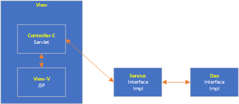

# 基础框架入门

## MVC与三层架构

### 三层架构

​	　**三层架构**是视图层 `View`、服务层 `Service`，与持久层 `DAO`。它们分别完成不同的功能。**View 层**用于接收用户提交请求的代码，系统的业务逻辑主要在**Service 层**完成，**DAO 层**直接操作数据库的代码。


​	　为了更好的降低各层间的耦合度，在三层架构程序设计中，采用**面向抽象编程**。即上层对下层的调用，是通过接口实现的。而下层对上层的真正服务提供者，是上层接口的实现类。服务标准（接口）是相同的，服务提供者（实现类）可以更换。这就实现了**层间解耦合**。


### MVC模式

​	　**MVC**即 Model模型、View视图，及 Controller控制器。`View`为用户提供使用界面，与用户直接进行交互。`Model`用于承载数据，并对用户提交请求进行计算的模块。其分为两类，一类称为**数据承载 Bean (DAO)**，一类称为**业务处理 Bean (Service)**。所谓数据承载 Bean 是指实体类，专门用户承载业务数据的，如 Student、User 等。而业务处理 Bean 则是指 Service 或 Dao 对象， 专门用于处理用户提交请求的。`Controller`用于将用户请求转发给相应的 Model 进行处理，并根据 Model 的计算结果向用户提供相应响应。


### 三层架构 + MVC

​	　`三层架构`与`MVC`这两种结构既有区别，又有联系。但这两种结构的使用，均是为了**降低系统模块间的耦合度**，将将业务与展示分离。




## Junit单元测试

​	　JUnit 是用于编写和运行可重复的**自动化测试**的开源测试框架，这样可以保证我们的代码按预期工作。

**实战：**

- [第一个Junit单元测试](../demo/第一个Junit单元测试.md)


### TDD测试驱动

​	　`TDD`是**测试驱动**编程思想，提倡“**先编写测试用例，再完成编码**”，这样保证了代码质量，测试的覆盖率高，但是开发效率低。测试时**按照不同的场景**分为有单元测试、压力测试、疲劳强度测试、冒烟测试、集成测试、回归测试等。

```
单元测试：分为白盒测试、黑盒测试、灰盒测试
压力测试：专门用于测试应用最大可以承载多少并发
疲劳强度测试：测试程序能否长期（72时 ~ 7天）稳定运行
冒烟测试：对主要流程(支付环节)进行频繁、高强度的测试
集成测试：对完整功能进行测试，最重要的是测试整体业务流程
回归测试：若测试完后，应用又新增了一个功能或BugFix，需要针对这个功能或BugFix进行回归测试
```


### Junit注解

（1）@Test

​	　`@Test`注解表明该方法是一个测试方法。当想暂时禁用特定的测试方法执行时，可以使用`@Ignore`注解。

```java
@Test
public void testLog4j() {
    System.out.println("Hello Log4j");
}
@Ignore
public void ignoreLog4j() {
    System.out.println("Hello IgnoreLog4j");
}
```

（2）@Before 和 @After

​	　	`@Before` 和 `@After` 注解 表明该方法必须在类中**每个测试方法**执行 `之前/之后` 执行。

```java
@Before
public void before() {
    System.out.println("执行 before() 方法");
}
@After
public void after() {
    System.out.println("执行 after() 方法");
}
```


（3）@BeforeClass和 @AfterClass

​	　`@BeforeClass` 和 `@AfterClass`注解只能在**测试用例类执行** `之前/之后` 执行**一次,** 方法必须声明为`public static`。多用于开启资源和关闭资源。

```java
@BeforeClass
public void static beforeClass() {
    System.out.println("执行 beforeClass() 方法");
}
@AfterClass
public void static afterClass() {
    System.out.println("执行 afterClass() 方法");
}
```


### Junit断言

​	　断言是指在可以**断定程序中的某个特定点的布尔表达式值**为true，则继续运行，若为false，则**中断**当前操作的话，可以使用断言。一般在 **测试** 或 **出现BUG**时**启用断言**，而在**部署时禁用断言**。使用断言可以创建更稳定、品质更好且 不易于出错的代码。

（1） 断言两个值相等

```java
/**
 * 断言两个变量相等
 * message : 可选的字符串,自定义抛出异常信息
 * 入参类型：int, short, long, byte, char, Object
 * */
void assertEquals([String message], expected value, actual value2)；
```


（2）断言一个条件为真/假

```java
/**
 * 断言条件为真
 * message : 可选的字符串,自定义抛出异常信息
 * condition：需要断言的条件
 * */
void assertTrue([String message], boolean condition);

/**
 * 断言条件为假
 * message : 可选的字符串,自定义抛出异常信息
 * condition：需要断言的条件
 * */
void assertFalse([String message],boolean condition)
```


（3）断言一个对象是否为空

```java
/**
 * 断言一个对象不为空(null)
 * */
void assertNotNull([String message], java.lang.Object object);

/**
 * 断言一个对象为空(null)
 * */
void assertNull([String message], java.lang.Object object)
```


（4）断言两个对象是否引用相同的对象

```java
/**
 * 断言两个对象引用相同的对象
 * */
void assertSame([String message], java.lang.Object expected, java.lang.Object actual)
    
/**
 * 断言两个对象不是引用同一个对象
 * */
void assertNotSame([String message], java.lang.Object unexpected, java.lang.Object actual)
```


（5）断言预期数组和结果数组相等

```java
/**
 * 断言预期数组和结果数组相等
 * 数组的类型： int, long, short, char, byte, Object
 * */
void assertArrayEquals([String message], expectedArray, resultArray)
```


## Log4j日志

​	　`Log4j` ( `Log for java`)是专门用于 Java 语言的日志记录工具。`Log4j`是通过**日志输出控制文件(**`log4j.properties`)来控制日志输出，代码中只要设置好**日志信息内容**及**日志级别**，即可在开发、测试、维护、运行等环节，向控制台或文件等位置输出**大量**日志信息。

**实战：**

- [第一个Log4j日志文件](../demo/第一个Log4j日志文件.md)


### log4j.properties

​	　日志属性文件包含**日志附加器**和**根日志**两个对象，主要由日志信息的输出`位置`、`格式`、`级别`这三部分组成。**输出位置**控制日志信息将要输出的位置是**控制台**还是**文件**等，日志信息的**输出格式**控制日志信息的显示格式，日志信息的**输出级别**控制要输出的**日志级别**。

（1）根日志

​	　根日志(`log4j.rootLogger`)是 Java 代码中的**日志记录器**，如可配置日志级别为 `INFO` 和 预定义了名称为 `console`、`file` 两种附加器。

```properties
log4j.rootLogger=INFO, console, file
```


（2）日志附加器

​	　日志附加器本质是一个接口，由**日志输出位置定义**，可以为日志记录器附加上很多其它设置信息，如输出布局、文件位置、文件大小等，定义语法为：

```properties
log4j.appender.appenderName = 输出位置
```


### 日志附加器

（1）常用的附加器实现类

① console 附加器

```properties
 # 日志输出到控制台
log4j.appender.console=org.apache.log4j.ConsoleAppender
```

② file 附加器

```properties
#日志输出到文件
log4j.appender.file=org.apache.log4j.FileAppender
#每天产生一个日志文件
log4j.appender.file=org.apache.log4j.DailyRollingFileAppender
#当日志文件大小到达指定大小时将产生一个新的日志文件
log4j.appender.file=org.apache.log4j.rolling.RollingFileAppender
```


（2）常用布局类型

​	　布局类型分为简单布局、网页布局、匹配器布局。以`console`输出位置举例，如下展示了不同布局类型的引用方式。

```properties
# 网页布局，以 HTML 表格形式布局
log4j.appender.console.layout=org.apache.log4j.HTMLLayou
# 简单布局，包含日志信息的级别和信息字符串
log4j.appender.console.layout=org.apache.log4j.SimpleLayout
# 匹配器布局，可以通过ConversionPattern属性灵活地指定布局模式
log4j.appender.console.layout=org.apache.log4j.PatternLayout
log4j.appender.console.layout.ConversionPattern=%d %p [%c] - %m%n
```

​	　布局类型`org.apache.log4j.PatternLayout`是一种**匹配器布局**，可以通过设定 `ConversionPattern`属性值来控制具体输出格式的 。

```
%m：输出代码中指定的消息
%p：输出优先级，即 DEBUG，INFO，WARN，ERROR，FATAL
%r：输出自应用启动到输出该 log 信息耗费的毫秒数
%c：输出所属的类目，通常就是所在类的全名
%t：输出产生该日志事件的线程名
%n：输出一个回车换行符，Windows 平台为 /r/n，Unix 平台为 /n
%d：输出日志时间点的日期或时间,默认格式为ISO8601,可指定格式为%d{yyy MMM dd HH:mm:ss,SSS}
%l：输出日志事件的发生位置，包括类目名、发生的线程，以及在代码中的行数。
```


### 使用Junit日志

（1）设置日志级别

​	　在调试、运维的过程中需要将必要的日志进行输出，但是**输出语句若在程序运行时全部执行**， 则势必会**降低运行效率**，所以对日志信息进行**分级管理**，将日志级别由高到低，共分 6 个级别：

```
- fatal(致命的)
- error
- warn
- info
- debug
- trace(线程级别日志)
```


（2）日志信息内容

​	　slf4j (`Simple Loging Facade For Java`) 是为 Java 程序提供**日志输出的统一接口**，slf4j须搭配其他具体的日志实现方案，比如 apache 的 `org.apache.log4j.Logger`、JDK 自带的 `java.util.logging.Logger` 或者 目前比较流行的是`Logback`框架，我们这边以 apache 的 `org.apache.log4j.Logger`为例。

```java
logger.info("slf4j message is : {}", "message");
```

​	　使用`{}` 占位符来打印日志，可以减少字符串拼接操作。类似于在使用`System.out.println()`打印日志时，使用`String.format()`中的`%s`作为占位符输出日志。

```java
String.format("meaasge is : %s %s",message1,message2);
```


## Cache

## HttpClient

