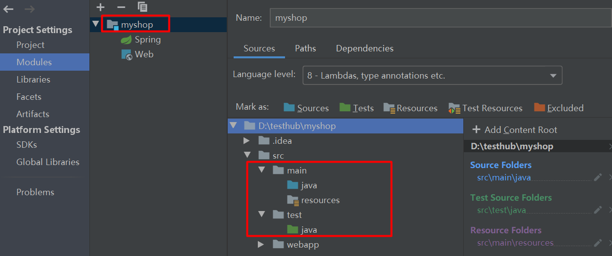
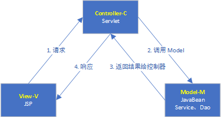

# 快速入门


**实战：**

- [v1.0 项目初始化]()


## Intellij IDEA

​	　IDEA 全称 IntelliJ IDEA，是互联网公司主流的 Java 集成开发环境，在智能代码助手、代码自动提示、重构、J2EE 支持、各类版本同步工具(`git`、`svn`、`github`等)、JUnit、CVS 整合、代码分析、 创新的 GUI 设计等方面的功能拥有着卓越的效率。

### IDEA Setting

​	　IDEA中的环境配置有`Setting`和`Default Setting`，两种配置项相同，只是作用范围不同。`Setting`用于特定的项目中，`Default Setting`是共用的配置。

#### 快捷键简介

```
[代码编辑]
- ctrl + w：智能选取，实现选取范围的不断扩充
- crtl + alt + l：代码格式化
- shift + alt + insert：列编辑
- 双击选中 -> shift + F6 ：批量修改

[自动生成代码]
- alt + insert：自动代码生成
- psvm + enter: 快捷生成main代码
- sout + enter: 快捷生成System.out.println();
- .val : 快捷生成变量名
- div.container + tab : 自动生成div标签

[常用功能]
- ctrl + e： 显示最近打开过的文件
- ctrl + n： 显示类名查找框
- ctrl + q： 显示 JavaDoc 的结果
- ctrl + shift + r：全局搜索
- F2：定位下一个有问题的地方

[编译运行]
- ctrl + F9: build
- shift + F9: debug
- alt + f8: 查看debug中的变量值
```

 

#### Plugins安装

​	　在`File` -> `Plugins`中下载如下IDEA插件，有助于提升开发效率。

```
MyBatis Log Plugin 				  将Mybatis执行的sql脚本显示出来
MybatisCodeHeplerPro 	          让你的mybatis.xml像java代码一样编辑
Lombok Plugin				      代码注解插件
Alibaba Java Coding Guidelines    阿里巴巴 Java代码规范插件
jclasslib bytecode viewer 	      可视化的字节码查看插件
```


#### Maven设置

​	　在IDEA中自定义配置Maven（建议配置在`Default Setting`中），需要**配置Maven主目录**、**勾选Override重置setting文件目录**、**勾选Override重置本地仓库**目录三步。


### Project Struct

#### ProjectSDK

​	　选择 `File` -> `Project Structure`，在弹出的窗口中，设定**JDK 的安装路径**以及**项目语言级别**。


#### Modules

​	　需要将项目中目录`Mark As`不同的含义，`Sources`表示代码、`Resources`表示资源目录、`Test`表示测试用例、`Test Resources`表示测试资源。

（1）标记文件目录




（2）设置Web Resource Directory

​	　对于**Servlet项目**或者**前后端未分离**的项目，资源是部署在`webapp`目录下的，此时，还需要点击`myshop`下的`Web`，在`Deployment Descriptors`中配置 `web.xml` 的位置 和 在`Web Resource Directories`中配置webapp资源目录位置、资源部署的根目录为 `/`才能正常加载资源 。


（3） 配置Spring Context

​	　若项目中包含`Spring`配置，还需要配置Spring的xml配置文件的位置。


####  Artifacts

​	　对于需要部署到Tomcat的项目，还需要`Web Application`。首先需要在`Artifacts`中点击 `+`  号，选择`Web Application:Exploded`，然后选择`Form Modules` ，在弹出的窗口中选择当前项目`myshop`即可。


​	　新建完成后，可以得到如下图的配置结果，接着在Tomcat的`Deployment`中就可以配置`Artifacts`了。


### Tomcat部署

#### Server

​	　对于需要部署在Tomcat中的项目，还需要配置Tomcat运行环境。首先在IDEA的顶部工具栏中选择 `Run` -> `Edit Configurations`，然后在弹出页面的左上方选择 `+` 号 -> `Tomcat Server` -> `Local`，最后填写Tomcat的名称、配置自动更新、选择 Tomcat 的安装、发布路径。


​	　选择`Update class and resources` 是采用**热部署**的方式启动Tomcat，可以让在**变更java文件**或者**web资源**时，无需重启Tomcat。但是要注意新增java文件或者资源是不能生效的。


#### Deployment

​	　继续上一步，选择 [Deployment] ->[+] 号 ->[Artifact]后，点击[apply]保存配置，完成 Tomcat 本地部署


​	　`artifact:war exploded`表示项目以**虚拟化目录**（即将 `/projectName` -> `Application context自定义的路径 / 上`）的形式发布到Web服务器上，如以上的配置通过<a>http://localhost:8080/</a>即可访问项目。而`artifact:war`是以真实目录进行发布的，发布路径是`/projectName`，不建议使用`artifact:war`进行部署。

::: tip 注意
若点击[+] 号后，没有exploded的Artifact，则需要在Project Structure的Artifacts中进行配置 或者 点击 `Fix`按钮自动添加
:::


## Maven

​	　 Maven由Apache公司采用Java语言编写，是一个**项目管理和综合工具**，提供了可以构建一个完整的**生命周期**框架。Maven 使用**标准的目录结构**和**默认构建生命周期**，**简化**和**标准化**项目**自动构建过程**，增加`可重用性`并负责建立相关的任务，使编译、分配、文档、团队协作和其他任务可以无缝连接。


### 快速开始

::: warning 环境准备
确保JDK 为1.8 及以上版本，并已设置JAVA_HOME 环境变量
:::

​	　 首先在[maven官网](https://maven.apache.org/download.cgi)下载 Maven 的 zip 文件，然后解压到安装目录后，在`config/settings.xml`配置文件中修改`localRepository`元素值(可选)，来自定义Maven本地仓库路径。

```xml
 <localRepository>F:/Reference/mave/Respository</localRepository>
```

​	　 接着，找到`mirrors`元素， 在它里面添加子元素`mirror`，设置Maven镜像为阿里云镜像，从而加快从中央仓库下载`Jar`包的速率。

```xml
<!-- 阿里云中央仓库 -->
<mirror>
    <id>nexus-aliyun</id>
    <mirrorOf>central</mirrorOf>
    <name>Nexus aliyun</name>
    <url>http://maven.aliyun.com/nexus/content/groups/public</url>
</mirror>
```

​	　 最后，在环境变量中新增`MAVEN_HOME`值为Maven安装路径（如：E:\Server\apache-maven-3.5.3），然后**追加**`%MAVEN_HOME%\bin`到`path`中即可。配置完成后，可以在cmd中运行`mvn -version`命令验证是否已经安装成功。

```
C:\Users\User>mvn -version
Apache Maven 3.5.3 (3383c37e1f9eff9f295297; 2018-02-25T03:49:05+08:00)
Maven home: E:\Server\apache-maven-3.5.3\bin\..
Java version: 1.8.0_161, vendor: Oracle Corporation
Java home: E:\JDK\JDK8\jre
Default locale: zh_CN, platform encoding: GBK
OS name: "windows 10", version: "10.0", arch: "amd64", family: "windows"
```


### POM对象

​	　POM（**项目对象模型**）位于**项目的基本目录**中，是 Maven 工作的**基本单位**。每个项目只有**一个** POM 文件，POM以XML方式配置Jar包、插件等的坐标信息。

（1）POM主要节点

​	　POM的根元素是[**project**]，由`groupId`**，**`artifactId`和`version`三个主要节点（必填）组成，这三个属性是项目仓库的唯一标识，项目在仓库中的项目符号由`groupId:artifactId:version`表示。 

- groupId：由`公司域名反转.项目组名称` 组成，全球唯一
- artifactId：表示唯一的项目名称
- version：表示项目版本号，用于将不同的版本彼此分离

```xml
<!--pom.xml 基本构成-->
<project xmlns="http://maven.apache.org/POM/4.0.0"
   xmlns:xsi="http://www.w3.org/2001/XMLSchema-instance"
   xsi:schemaLocation="http://maven.apache.org/POM/4.0.0
   http://maven.apache.org/xsd/maven-4.0.0.xsd">
   
   <modelVersion>4.0.0</modelVersion>
   <groupId>com.company.group</groupId>
   <artifactId>test</artifactId>
   <version>1.0.0</version>
  
<project>
```


（2）POM其他节点

​	　此外，POM的根元素是[**project**]下还有`packaging`（打包格式）、`name`（表示项目名称）、`description`（项目描述信息）、`dependencies`（项目依赖配置）和`properties` (自定义属性)等节点信息。

```xml
<packaging>war</packaging>
<name>transport</name>
<description>运输系统</description>
```

​	　　`dependencies`节点是项目依赖配置，整个项目生命周期中所需的依赖都在这里配置。`dependency`中`jar`包坐标由`groupId`、`artifactId`、`version`组成，如下所示：

```xml
<dependencies>
    <dependency>
        <groupId>de.codecentric</groupId>
        <artifactId>spring-boot-admin-starter-client</artifactId>
        <version>${spring-boot.version}</version>
    </dependency>
</dependencies>
```

​	　`properties` 节点可以配置**自定义属性**，通过`${spring-boot.version}`可以在version中灵活的指定各个关联jar包的版本。

```xml
<properties>
    <project.build.sourceEncoding>utf-8</project.build.sourceEncoding>
    <jdk.version>1.8</jdk.version>
    <spring-boot.version>1.8</spring-boot.version>
</properties>
```


（3）语义化版本规范

​	　Java版本号常使用**语义化版本规范**或者**逢十进一**的方式，建议使用语义化版本规范。如初始版本号为`1.0.0` ，接下来版本命名方式如下：

```text
1.0.1 在第一个版本上修复BUG
1.1.0 在第一个版本上新增功能
2.0.0 结构发生变更
```


### Maven快照

​	　在使用**版本**时，如果 Maven 下载所提到的版本为 `data-service:1.0`，那么它永远不会尝试在库中下载已经更新的版本 1.0。要下载更新的代码，data-service 的版本**必须要升级到 1.1**。这样需要数据服务团在发布更新时每次都要告诉应用程序 UI 团队，请UI 团队更新一下 `pom.xml` 以获得更新应用的版本。为了处理这类情况，引入快照的概念。

​	　Maven版本与发行版和快照版两种。 **发行版**是**稳定的版本**，类和方法在命名、参数列表、功能上不会发生变更。**快照（SNAPSHOT）**是一个**特殊版本**，指出**目前开发拷贝**，快照不同于常规版本，Maven会在数据服务团队发布代码后更新快照存储库，使用新生成的快照来替换旧的快照。在使用快照时，Maven 会**自动获取最新的快照版本**。

```text
# 发行版
1.0.0-RELEASE
# 快照版(SNAPSHOT指代最新的快照版本号)
1.0.1-SNAPSHOT  -> 编译后动态生成后缀 1.0.1-20190310676786867
```


### Maven仓库

​	　 Maven在**依赖机制**的帮助下会根据`pom.xml` 文件中的`坐标信息`，在`maven仓库`中自动下载、更新所有必需的依赖库，并保持版本升级。

​	　 Maven 的本地仓库是用来存储所有项目的依赖关系(插件 Jar 和其他文件)， Maven首先从**本地Maven仓库**获取依赖，如果没有找到，会从[Maven中央存储库](http://repo1.maven.org/maven2/) 查找下载到本地仓库中。此外，如果在 `pom.xml` 中定义了远程仓库，最后还会在 **Maven 远程仓库**搜索。

::: tip 提示
可以使用 [MVNrepository](https://mvnrepository.com/) 查询Maven中央仓库中包含的依赖
:::


### Maven命令

​	　Maven 是一个**执行插件**的框架，每一个任务实际上是由插件完成的。一个Maven插件通常提供了一组目标，可使用以下语法来执行：

```
mvn [plugin-name]:[goal-name]
```


（1）Maven插件

​	　Maven插件分为 **构建插件** 和 **报告插件** 两种类型插件。构建插件是在**生成过程中执行**，报告插件在**网站生成期间执行**。Maven插件首先需要在 `pom.xml` 中的 元素进行配置，才能使用。

​	　Maven 插件通常用于创建 jar 文件、创建 war文件、编译代码文件、进行代码单元测试、创建项目文档、创建项目报告。


（2）常见的Maven命令

```
mvn clean：调用maven-clean-plugin，删除根目录下target目录
mvn compile：调用maven-compile-plugin编译源码到target目录下
mvn compiler:compile ：编译目标
mvn test：执行src/test/java目录下类名为*Test.java的单元测试类
mvn package：打包根目录下的目录，web project打成war包，java project打成jar包
mvn install：打包到本地仓库，解决本地多个项目公用一个jar包的问题
mvn -dmaven.test.skip=true：只打包不测试（跳过测试）
mvn source:jar或mvn source:jar-no-fork：源码打包
mvn tomcat:run	通过maven命令将web项目发布到Tomcat
```


（3）Maven生命周期

​	　 Maven在项目构建中存在`cleanLifeCycle`（清理生命周期）、`defaultLifeCycle`（默认生命周期)、`siteLifeCycle`（站点生命周期）三类生命周期，这三类生命周期间相互独立、互不影响，在一类生命周期之内，执行后面的命令前面的操作会自动执行。

```
- defaultLifeCycle：是默认生命周期，包含compile、test、package、install、deploy四个节点
- siteLifeCycle：用于生成描述项目的javadoc文档。
```


## MVC与三层架构

### 三层架构

​	　**三层架构**是视图层 `View`、服务层 `Service`，与持久层 `DAO`。它们分别完成不同的功能。**View 层**用于接收用户提交请求的代码，系统的业务逻辑主要在**Service 层**完成，**DAO 层**直接操作数据库的代码。


​	　为了更好的降低各层间的耦合度，在三层架构程序设计中，采用**面向抽象编程**。即上层对下层的调用，是通过接口实现的。而下层对上层的真正服务提供者，是上层接口的实现类。服务标准（接口）是相同的，服务提供者（实现类）可以更换。这就实现了**层间解耦合**。


### MVC模式

​	　**MVC**即 Model模型、View视图，及 Controller控制器。`View`为用户提供使用界面，与用户直接进行交互。`Model`用于承载数据，并对用户提交请求进行计算的模块。其分为两类，一类称为**数据承载 Bean (DAO)**，一类称为**业务处理 Bean (Service)**。所谓数据承载 Bean 是指实体类，专门用户承载业务数据的，如 Student、User 等。而业务处理 Bean 则是指 Service 或 Dao 对象， 专门用于处理用户提交请求的。`Controller`用于将用户请求转发给相应的 Model 进行处理，并根据 Model 的计算结果向用户提供相应响应。




### 三层架构 + MVC

​	　`三层架构`与`MVC`这两种结构既有区别，又有联系。但这两种结构的使用，均是为了**降低系统模块间的耦合度**，将将业务与展示分离。


